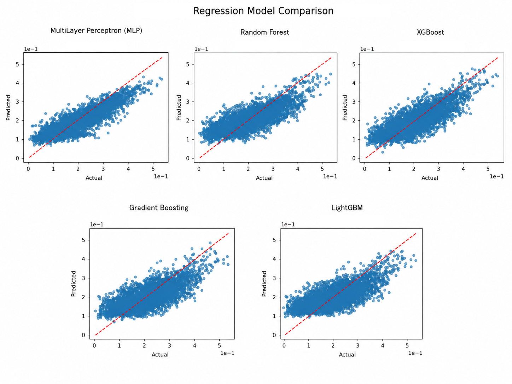

# Robot Object Distance Estimation from Vision

Estimate the **3D Euclidean distance** between a robotic manipulator and an object using **DINOv2 visual embeddings** and **classical machine learning regression models**.

This project evaluates whether visual embeddings extracted from DINOv2 can be used to estimate the **3D Euclidean distance** between a robot end-effector and an object from a **single RGB image**. The experiments are conducted in Gymnasium Fetch environments using several regression models.

## Overview

Instead of using handcrafted image features or end-to-end deep learning, the proposed pipeline consists of:

1. Render a 2D RGB image from the environment.
2. Extract visual embeddings using DINOv2.
3. Train regression models on the embedding vectors.
4. Predict the continuous robot-object distance.

## Pipeline

Environment → Image → DINOv2 → Embeddings → Regression Model → Distance Prediction

## Regression Models

The following regressors were evaluated:

- Random Forest
- XGBoost
- Gradient Boosting
- LightGBM
- Multi-Layer Perceptron (MLP)

## Evaluation Metrics

The models were compared using:

- Mean Absolute Error (MAE)
- Mean Absolute Percentage Error (MAPE)
- Root Mean Squared Error (RMSE)
- Coefficient of Determination (R²)

## Results

<p align="center">
  
</p>

| Model | MAE | MAPE | RMSE | R² |
|-------|-------:|--------:|--------:|------:|
| **MLP** | **0.0332** | **0.2243** | **0.0426** | **0.7239** |
| XGBoost | 0.0388 | 0.2735 | 0.0492 | 0.6321 |
| Random Forest | 0.0414 | 0.3010 | 0.0526 | 0.5790 |
| Gradient Boosting | 0.0439 | 0.3159 | 0.0556 | 0.5290 |
| LightGBM | 0.0448 | 0.3267 | 0.0565 | 0.5149 |

The MLP achieved the best predictive performance across all evaluation metrics.

## Dependencies

- Python 3.11
- PyTorch
- Transformers (DINOv2)
- Gymnasium Robotics (Fetch)
- Scikit-learn
- XGBoost
- LightGBM
- Matplotlib
- NumPy

## Repository

```
.
├── RobotDistanceEstimation.ipynb
├── README.md
├── requirements.txt
└── images/
```

## Future Work

- Improve distance estimation accuracy through model optimization
- Evaluate other foundation models (CLIP, SigLIP, DINOv3)
- Test additional robotic manipulation environments
- Investigate the use of the predicted distance for reward shaping in reinforcement learning

## Requirements

```bash
pip install -r requirements.txt
```

## Author

Gabriel Romio
